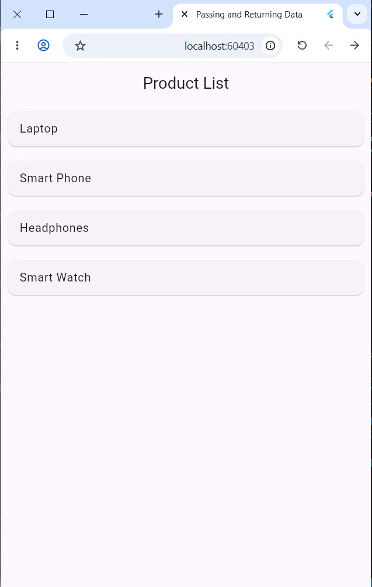
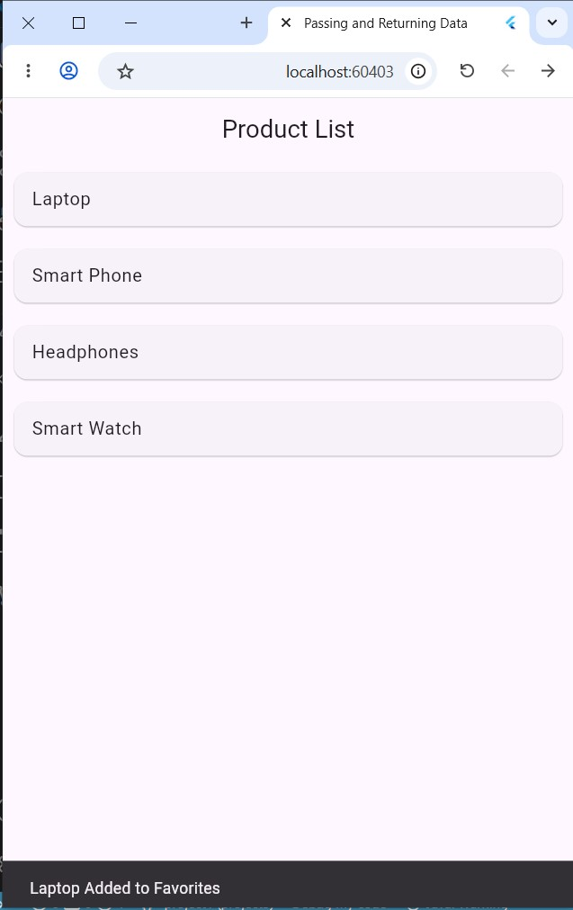
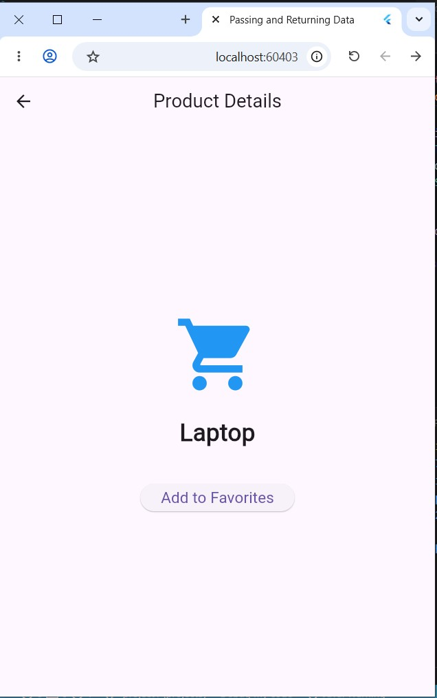

# Passing and Returning Data App

A simple Flutter application that demonstrates how to pass data between screens and return data back using Navigator.push() and Navigator.pop().

---

## Project Description

This app displays a list of products.  
When the user taps a product, the app navigates to a product details screen and passes the selected product name.

From the details screen, the user can add the product to favorites.  
Then the app returns a message back to the product list screen and displays it using a SnackBar.

---

## Technologies Used

- Flutter
- Dart
- Material Design

---

## Project Screenshots

### Product List Screen

### Product Details Screen

### Returning Data with SnackBar

---

## Features

- Product List Screen
- Product Details Screen
- Passing data to another screen
- Returning data back to the previous screen
- SnackBar message
- Navigator.push()
- Navigator.pop()

---

## Navigation Flow

Product List Screen
        |
        | pass product name
        v
Product Details Screen
        |
        | return favorite message
        v
Product List Screen + SnackBar
---

## Code Concepts Used

### Passing Data

Navigator.push(
  context,
  MaterialPageRoute(
    builder: (context) => ProductDetailsScreen(
      productName: productName,
    ),
  ),
);
### Returning Data

Navigator.pop(
  context,
  "$productName Added to Favorites",
);
### Receiving Returned Data

final result = await Navigator.push(...);

if (result != null) {
  ScaffoldMessenger.of(context).showSnackBar(
    SnackBar(content: Text(result.toString())),
  );
}
---

## Author

Husam Dirhem